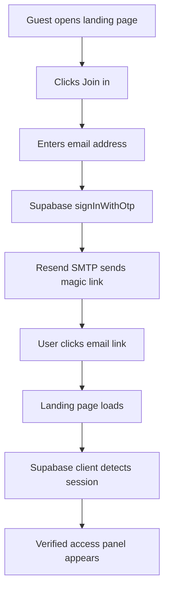
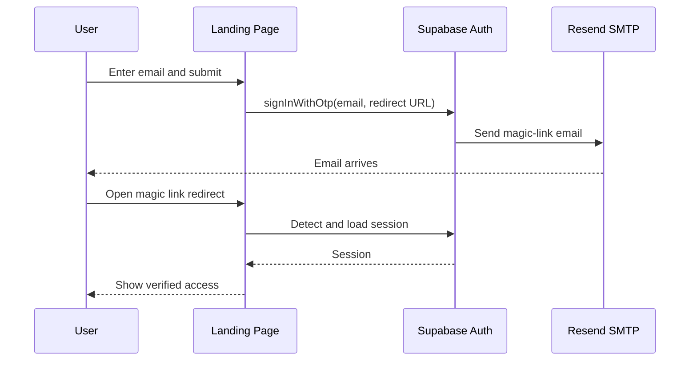

# Architecture

## Overview

The landing page is a static client application. Supabase Auth owns identity.
Supabase sends magic-link email through its configured Resend SMTP provider.

## Components

- `index.html`: welcome page, Join button, email form, verified-user panel.
- `styles.css`: responsive minimalist design system.
- `app.js`: Supabase client, magic-link request, session detection, sign-out.
- `config.js`: public deployment-time Supabase values.
- Supabase Auth: registration, magic links, session issuance.
- Resend SMTP: email delivery path configured inside Supabase.

## Runtime Flow

## Sequence

## Security and Permissions

- The frontend uses only the Supabase public anon/publishable key.
- Resend API credentials stay inside Supabase SMTP configuration.
- Service-role keys must never be added to `config.js`.
- Database ownership and premium gates remain separate from this UI flow.

## Deployment

Deploy `web-app/` as a static Cloudflare Pages project. Set Supabase Auth redirect
URLs to the final Pages URL. If the deployed path changes, update
`magicLinkRedirectUrl` in `config.js`.
